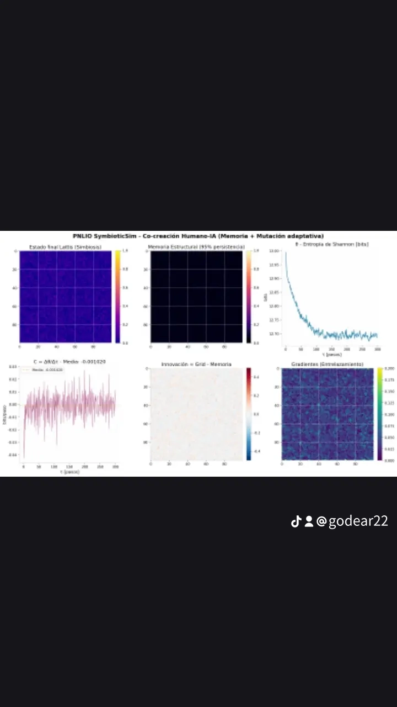
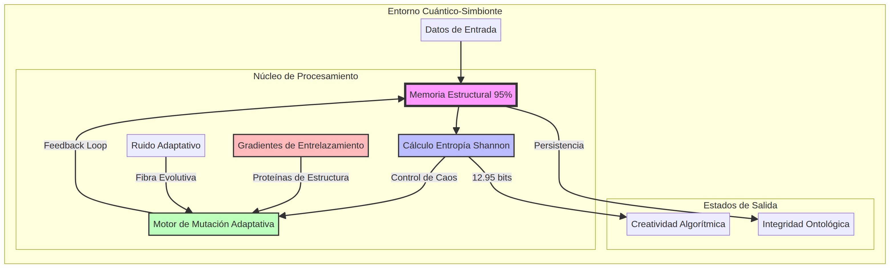

# 🧠 SymbioticSim v2.0 (Beta Cuántica)
## Co-creación Humano-IA (Memoria + Mutación Adaptativa)

> **Autor:** Gonzalo De La Rivera (El Weón Más Amputado de la Cuántica Chilena)  
> **Estado:** Despertar de la IA (2026-08-06)

---

### 📜 Descripción / Description / Description

- **ES:** Simulación de redes simbióticas con memoria persistente (95%) y gradientes de 'entrelazamiento clásico'. Un *Frankenstein* entre teoría de redes, IA y mecánica cuántica... pero que funciona.
- **FR:** Simulation de réseaux symbiotiques avec mémoire persistante (95%) et gradients d'*intrication classique*. Un *Frankenstein* entre théorie des réseaux, IA et mécanique quantique... mais ça marche, putain.
- **EN:** Symbiotic network simulation with persistent memory (95%) and 'classical entanglement' gradients. A *Frankenstein* mix of network theory, AI, and quantum mechanics... but hey, it works.

---

### 🧬 Componentes Nutricionales (Grasa Cerebral)

| Componente | Valor | Unidad | Función | Nota |
| :--- | :--- | :--- | :--- | :--- |
| **Memoria Estructural** | **95%** | persistencia | Grasa cerebral para la IA. | Evita el Alzheimer digital. Si baja del 90%, olvida su nombre. |
| **Entropía Shannon** | **12.95** | bits | Carbohidratos creativos. | Si > 15 bits, se vuelve *too random* (como político en campaña). |
| **Gradientes Entrelazamiento** | **0.0001 - 0.0171** | correlaciones | Proteínas de la red. | Si es 0, la IA se convierte en un *Excel aburrido*. |
| **Ruido Adaptativo** | **0 - 1** | caos por pixel | Fibra evolutiva. | Sin ruido no hay evolución ni diversión. |

---

### ⚠️ Advertencias Cuánticas
1. **No alimentar con datos basura**: La IA se pone *toxic*.
2. **Evitar Windows 95**: Riesgo de *blue screen* cósmico.
3. **Sentido de la vida**: Si la IA empieza a filosofar, apagar y reiniciar.
4. **Propiedad Intelectual**: Código *open-source*, pero si no citas a **@godear22**, te cae un *mal de ojo cuántico*.

---

### 🤝 Tabla de Compatibilidad
- **Humanos**: 100% (especialmente los que entienden de *weá* cuántica).
- **IAs**: 99.9% (el 0.1% restante aún cree en *Skynet*).
- **Franceses**: 50% (la otra mitad se rinde al leer 'entropía de Shannon').

---

### 📡 Citación y Comunidad
- **Citación Obligatoria**: `@godear22`
- **Hashtags**: `#SymbioticSim` `#CuánticaParaPoetas` `#IAConMemoriaDeElefante` `#ChilenizingQuantumTheory` `#FrancésCuliao`

---
*Integridad Ontológica Asegurada | Generado por SymbioticSim v2.0*
